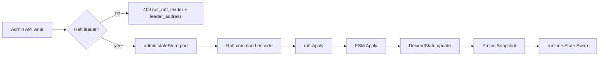

# Raft HA 구현 정리

이 문서는 리버스 프록시 POC에 HashiCorp Raft 기반 HA 설정 복제를 추가한 작업과 구현 내용을 정리한다. 상세 운영 규칙은 `docs/architecture/raft-config-state.ko.md`, API 응답 형식은 `docs/api/dashboard-api.ko.md`를 함께 본다.

## 목표

- 여러 리버스 프록시 컨테이너가 같은 proxy 설정 목표 상태를 공유한다.
- 설정 변경은 Raft leader를 통해 합의된 뒤 각 노드 런타임에 반영한다.
- 요청 처리 중 생기는 상태는 복제하지 않는다.
- 기본 부팅 경로는 single-node Raft cluster이며, 로컬 설정의 `configStore` mode selector와 `raftBootstrap` role flag는 제거됐다.

## 상태 모델

Raft로 복제하는 상태는 `DesiredState`다.

- `Namespaces`: namespace별 `spec.Config`
- `Version`: Raft log index 기반 버전
- `AppliedAt`: FSM 적용 시각

복제 대상:

- namespace 생성/삭제
- route 생성/수정/삭제
- upstream pool 생성/수정/삭제
- Admin API 쓰기를 통한 초기 desired state 생성

복제하지 않는 상태:

- health check 결과
- `least_connection` 카운터
- 프로세스 listen 주소
- dashboard 주소
- Raft bind/advertise/join/data dir
- 각 노드의 `configs/app.json`
- VIP failover 설정과 VIP 소유 상태

## 전체 흐름



쓰기 요청은 leader에서만 처리한다. follower에 쓰기 요청이 들어오면 payload 검증보다 먼저 `409 Conflict`, `code: "not_raft_leader"`를 반환한다. leader에서는 namespace 이름과 설정 유효성을 검증한 뒤 Raft log에 적용한다.

## 구현 모듈

### `internal/state`

Raft desired state 모델과 projection을 담당한다.

- `DesiredState`: Raft log/snapshot에 저장되는 목표 설정 상태
- `StateError`: HTTP status, 안정적인 error code, leader address를 포함하는 저장소 오류
- `ValidateNamespaceName`, `ValidateIdentifier`: JSON artifact와 Raft 경로에서 공유하는 이름 검증
- `ProjectSnapshot`: `DesiredState`를 기존 runtime snapshot으로 투영

`FileStore` 구현은 제거됐다. 앱 부팅은 프록시 route/upstream JSON을 읽지 않고, 런타임은 Raft FSM apply/restore callback으로만 snapshot을 교체한다.

### `internal/raft`

Raft 전용 구현을 새로 추가했다.

- `command.go`: Raft log에 기록할 command schema
- `fsm.go`: HashiCorp Raft FSM 구현
- `fsm_snapshot.go`: FSM snapshot/restore와 deep clone 처리
- `node.go`: Raft node, TCP transport, Bolt log/stable store, file snapshot store 구성
- `store.go`: admin 서비스의 `stateStore` 포트를 만족하는 Raft-backed 구현

Raft command schema에는 namespace, route, upstream pool 단위의 Admin API write만 남아 있다. 프록시 JSON seed/import 전용 command는 제거됐다.

FSM은 command를 적용하기 전 다음 조건을 검증한다.

- namespace 이름 형식
- 중복 생성, 없는 리소스 삭제/수정 같은 리소스 충돌
- route body ID와 path ID 일치
- upstream pool 삭제 시 route 참조 여부
- 전체 desired config가 기존 `spec`/runtime projection 규칙을 만족하는지

검증 실패는 Raft apply response에 status/code/message로 담겨 admin API까지 보존된다.

### `internal/app`

앱 시작 경로는 unconfigured control-plane을 먼저 구성한다.

- `boot.Load()` 기본값: `raftDataDir: "data/raft"`와 listen 주소를 채운다. Raft node identity는 bootstrap/join 입력으로 받는 것이 기본 경로다.
- `configStore`는 더 이상 로컬 설정 입력이 아니다.
- clean node는 Raft FSM/node/store를 만들지 않고 dashboard/admin API를 동적 store proxy에 연결한다.
- 기존 Raft data dir이 있으면 재시작 복원을 위해 Raft FSM/node/store를 자동으로 구성한다.

Raft 모드 시작 규칙:

- 기존 Raft state 없음: unconfigured 상태로 시작하며 설정 쓰기는 `cluster_not_configured`로 거부
- 기존 Raft state 있음: Raft log/snapshot에서 복원
- `GET /api/node/cluster-status`: 현재 노드의 lifecycle state, 기존 Raft state 여부, bootstrap/join 가능 여부 조회
- `POST /api/cluster/bootstrap`: clean node에서 단일 노드 cluster 생성, VIP가 있으면 Raft desired state에 기록
- `POST /api/node/join-cluster`: clean node에서 Raft node 생성 후 peer admin URL 후보를 순회해 leader의 `/api/cluster/join` 호출

FSM apply 또는 restore가 성공하면 `ProjectSnapshot`으로 runtime snapshot을 다시 만들고 `runtime.State`와 health checker를 교체한다.

VIP 상태는 node-local interface와 cluster-wide desired state로 분리하는 방향으로 정리 중이다.

- cluster-wide: VIP address, GARP count/interval, acquire delay, release-on-shutdown 정책
- node-local: Linux interface 이름
- `vip.enabled` 입력은 제거됐으며, 현재 코드는 `vip.address`가 있으면 활성으로 본다.
- `/api/status`의 `vip.enabled` 필드는 기존 API 호환을 위해 유지한다.

### `internal/admin`

admin 서비스가 파일 직접 조작 대신 내부 `stateStore` 포트를 사용하도록 정리됐다.

- 앱 wiring은 `NewWithConfigState(store)`로 Raft-backed 구현을 직접 연결
- `StateError`의 `Code`, `LeaderAddress`, validation details가 API error로 보존됨

### `internal/dashboard`

Raft join API, node status, runtime, cluster 조회 API와 leader 오류 응답이 추가됐다.

- `GET /api/status`
- `GET /api/runtime`
- `GET /api/cluster`
- `POST /api/cluster/bootstrap`
- `POST /api/cluster/join`
- `POST /api/node/join-cluster`
- request body: `node_id`, `raft_address`
- `node_id`: 문자, 숫자, `.`, `_`, `-`만 허용
- `raft_address`: TCP `host:port` 형식이어야 함
- 요청을 받은 노드가 leader가 아니면 `not_raft_leader` 반환

`/api/cluster/join`은 admin/control-plane endpoint다. 이 POC에는 내장 인증이 없으므로 보호된 admin network 또는 외부 인증/network policy 뒤에 둬야 한다.

## 설정 예시

Local app config 예시:

```json
{
  "proxyListenAddr": ":8080",
  "dashboardListenAddr": ":9090",
  "raftDataDir": "data/raft"
}
```

Bootstrap 요청 예시:

```json
{
  "node_id": "node-1",
  "raft_bind_addr": "0.0.0.0:7001",
  "raft_advertise_addr": "10.0.0.11:7001",
  "vip": {
    "address": "10.0.0.100/24",
    "interface": "eth0"
  }
}
```

VIP address/GARP 정책은 local app config가 아니라 `POST /api/cluster/bootstrap` 요청으로 전달한다. join node의 VIP interface도 `POST /api/node/join-cluster` 요청으로 전달한다.

Join node도 local app config에는 Raft identity를 넣지 않는다. `/api/node/join-cluster` 요청으로 `node_id`, `raft_bind_addr`, `raft_advertise_addr`, `peers`를 전달한다. `raft_bind_addr`를 생략하면 `raft_advertise_addr`의 port를 사용해 `0.0.0.0:<port>`로 기본값을 채운다. 반면 `not_raft_leader` 응답의 `leader_address`는 HashiCorp Raft가 보고한 Raft advertise address이며, dashboard/admin HTTP URL이 아닐 수 있다.

## JSON 파일과 Raft 상태의 관계

노드 부팅 설정과 프록시 desired state의 역할을 분리했다.

- `configs/app.json`: 계속 노드 로컬 설정 파일로 사용
- 프록시 route/upstream 설정과 cluster-wide VIP 설정: Admin API 쓰기로 Raft log에 기록
- VIP interface: node-local 설정 또는 bootstrap/join 입력으로 유지
- 정상 운영 중 설정 변경의 source of truth: Raft log/snapshot

이미 클러스터가 구성된 적이 있는 노드는 Raft data dir의 log/snapshot에서 복원한다. 재시작이나 재합류 시 로컬 프록시 JSON이 클러스터 상태를 덮어쓰는 경로는 없다.

## 검증 내용

추가된 주요 테스트:

- desired state projection 테스트
- Raft FSM command, validation, snapshot/restore 테스트
- Raft store leader/follower, context cancel, invalid namespace, apply rejection mapping 테스트
- Raft in-memory integration replication 테스트
- app raft mode wiring, empty bootstrap/join rule, join timeout 테스트
- VIP config validation, controller acquire/release, app lifecycle 테스트
- Linux target `internal/vip` compile 검증
- dashboard not-leader response와 join request validation 테스트

최종 확인 명령:

```bash
go test ./...
```

## 구현 커밋 흐름

- `c9eb612`: desired state projection 추가
- `4f5a755`: file config store 추가
- `29786a6`: admin 서비스가 config store를 사용하도록 리팩터링
- `aedc806`: file store write 후 runtime reload 보정(이후 FileStore 제거로 대체됨)
- `2807da3`: Raft FSM 추가
- `ff0598f`: Raft node/store 추가
- `13c8bb4`: app config와 raft mode wiring 추가
- `95d4175`: dashboard에 Raft write error 노출
- `0767ddf`: Raft replication integration test 추가
- `a93045a`: join semantics 보강
- `8f663b9`: join validation, namespace validation, timeout, 문서 보강

## 남은 운영 전제와 후속 과제

- `/api/cluster/join` 인증은 아직 없다. 운영 환경에서는 반드시 보호된 네트워크나 외부 인증 뒤에 둔다.
- leader 자동 forwarding은 구현하지 않았다. client/operator가 leader hint를 보고 leader admin endpoint로 다시 요청해야 한다.
- membership 제거, leadership transfer, snapshot tuning, 장애 복구 runbook은 별도 작업으로 남아 있다.
- 실제 컨테이너 오케스트레이션 환경에서는 stable node ID, stable Raft advertise address, persistent Raft data volume이 필요하다.
- VIP address와 interface가 지정된 상태에서 해당 VIP가 이미 존재하면 이 프로세스가 관리 대상으로 간주하고 GARP를 송신한다. 같은 VIP를 다른 시스템이나 수동 설정이 이미 소유하는 상황은 초기 범위에서 자동 탐지하지 않는다.
