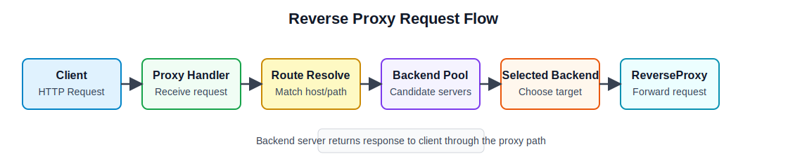

# 3주차 연구노트

## 진행 목표

3주차의 목표는 Go 기반으로 reverse proxy 기능을 실제로 구현하기 시작하는 것이었다. 1주차와 2주차에서 프로젝트 범위와 기존 오픈소스 구조를 정리했으므로, 이번 주차에는 HTTP 요청을 받아 backend 서버로 전달하는 기본 실행 흐름을 만드는 데 중점을 두었다.

또한 `net/http`와 `net/http/httputil`을 학습하고, 이를 바탕으로 자체 reverse proxy handler를 구성하는 것을 목표로 하였다. 관리자 대시보드는 현재 로드밸런서 상태를 확인하기 위한 1차 형태로 두고, heartbeat 기능은 backend 상태를 확인하기 위한 기반 기능으로 다루었다.

## 진행 내용

먼저 Go의 `net/http` 패키지에서 서버와 handler를 구성하는 주요 타입을 학습하였다. `http.Server`는 listen 주소와 handler를 묶어 HTTP 서버를 실행하는 구조이고, `http.Handler`는 `ServeHTTP(http.ResponseWriter, *http.Request)` 메서드로 요청을 처리하는 인터페이스다. `http.ServeMux`는 요청 path에 따라 handler를 연결하는 기본 라우터 역할을 한다. 요청 데이터는 `http.Request`에서 확인하고, 응답 상태와 본문은 `http.ResponseWriter`를 통해 작성한다.

그 다음 `net/http/httputil`의 `ReverseProxy` 구조를 학습하였다. `httputil.NewSingleHostReverseProxy`는 특정 target URL로 요청을 전달하는 reverse proxy handler를 만들 수 있다. 이를 그대로 사용하는 것만으로도 단일 backend로 요청을 전달할 수 있지만, 로드밸런서에서는 요청마다 적절한 backend를 선택해야 하므로 앞단에서 route 해석과 backend 선택 과정이 필요하다. 이번 주차에서는 이 점을 고려해 요청을 받은 뒤 route를 찾고, 해당 route가 가리키는 backend 그룹에서 target을 선택한 다음 reverse proxy로 전달하는 흐름을 구성하였다.

설정 파일 구조도 함께 설계하고 구현하였다. 서버 실행에 필요한 설정과 프록시 동작에 필요한 설정을 하나의 파일에 섞지 않고 분리하였다. `configs/app.json`은 프록시 서버와 관리자 대시보드 서버의 listen 주소, 프록시 설정 파일 디렉토리 같은 서버 실행 설정을 담는 파일로 두었다. 반면 `configs/proxy/*.json`은 route, upstream pool, backend target, health check 설정처럼 실제 프록시 동작을 정의하는 파일로 두었다. 이렇게 분리하면 서버를 어디에서 실행할지에 대한 설정과 어떤 요청을 어떤 backend로 보낼지에 대한 설정을 서로 다른 책임으로 관리할 수 있다.

설정 로드 과정에서는 앱 설정을 먼저 읽고, 그 안에 지정된 프록시 설정 디렉토리에서 여러 JSON 파일을 읽는 흐름으로 구성하였다. 프록시 설정 파일은 파일 이름을 기준으로 source 이름을 부여하고, route ID와 upstream pool ID는 이 source를 포함한 전역 ID로 변환하도록 설계하였다. 예를 들어 `default.json`에 있는 `r-api` route는 런타임에서 `default:r-api`처럼 구분할 수 있다. 이 방식은 여러 설정 파일에 같은 local ID가 있더라도 런타임에서는 충돌 없이 관리하기 위한 구조다.

설정을 읽은 뒤에는 곧바로 요청 처리에 사용하지 않고, route table과 upstream registry로 변환하였다. route table은 host와 path 조건을 기준으로 요청이 어떤 upstream pool로 가야 하는지 판단하는 구조이고, upstream registry는 pool 안의 backend target 목록과 선택 상태를 관리하는 구조다. 최종적으로 이 결과를 runtime snapshot에 보관하고, proxy handler는 매 요청마다 이 snapshot을 기준으로 route를 찾고 target을 선택하도록 구성하였다.

요청 처리 흐름은 아래와 같이 정리할 수 있다.

이 구조에서 중요한 점은 요청을 전달하는 reverse proxy 기능과 backend를 선택하는 기능을 분리하는 것이다. Nginx와 HAProxy 조사에서 확인한 것처럼, 요청 조건을 해석하는 부분과 실제 서버 pool을 관리하는 부분이 분리되어 있으면 이후 기능을 확장하기 쉽다. 이번 주차의 구현은 아직 복잡한 알고리즘 비교보다 기본 요청 전달 경로를 만드는 데 초점을 두었고, backend 선택은 이후 로드밸런싱 알고리즘을 적용할 수 있도록 별도 책임으로 남겨 두었다.

관리자 대시보드는 현재 시스템 상태를 확인하기 위한 1차 형태로 구성하였다. 대시보드에서는 서버가 어떤 설정을 기준으로 실행 중인지, 어떤 route와 backend 구성이 적용되어 있는지 확인할 수 있어야 한다. 이번 주차에는 설정을 수정하는 복잡한 관리 기능보다, 현재 런타임 상태를 조회하고 화면 또는 API를 통해 확인할 수 있는 구조를 우선하였다. 이는 이후 기능을 추가하거나 테스트를 진행할 때 현재 적용된 상태를 확인하기 위한 기반이 된다.

Heartbeat 기능은 backend 서버가 정상적으로 응답하는지 확인하기 위한 기반 기능으로 두었다. 로드밸런서는 단순히 여러 backend 중 하나를 고르는 것뿐만 아니라, 장애가 있는 backend를 계속 선택하지 않도록 상태를 관리해야 한다. 이번 주차에는 backend별 health check 경로, 기대 응답 상태, target별 상태 저장 위치를 설계하였다. 실제로 주기적인 요청을 보내 target 상태를 갱신하고, 그 결과를 선택 로직에 반영하는 active health check는 이후 주차의 구현 범위로 남겨 두었다.

## 검토 및 결과

이번 주차 작업을 통해 reverse proxy의 기본 요청 처리 흐름을 정리할 수 있었다. 클라이언트 요청을 받은 뒤 route를 해석하고, backend 그룹에서 target을 선택한 다음 `httputil.ReverseProxy`를 통해 요청을 전달하는 구조가 핵심이다. 이 흐름은 단순한 요청 중계 기능을 넘어서, 이후 로드밸런싱 알고리즘과 health check를 붙일 수 있는 기반이 된다.

또한 대시보드와 heartbeat 기능을 별도 보조 기능으로 두는 것이 필요하다는 점을 확인하였다. 대시보드는 현재 적용된 상태를 확인하기 위한 관측 수단이고, heartbeat는 backend 상태를 관리하기 위한 기반이다. 두 기능은 요청 전달 자체와 직접 동일한 역할은 아니지만, 로드밸런서를 실제로 운영하거나 테스트하려면 반드시 필요한 주변 기능이다.

## 다음 주차 계획

4주차에는 로드밸런싱 알고리즘을 학습하고, backend 선택 로직을 모듈화할 계획이다. 우선 Round Robin을 기본 알고리즘으로 두고, Hash와 Least Connections 같은 알고리즘을 적용할 수 있는 구조를 검토한다.

또한 관리자 대시보드 2차 구현에서는 route, backend, health 상태뿐 아니라 로드밸런싱 알고리즘과 관련된 정보를 확인할 수 있도록 보강할 예정이다. 3주차에서 만든 기본 reverse proxy 흐름을 바탕으로, 다음 주차에는 요청을 어느 backend로 보낼지 결정하는 정책을 구체화한다.

## 관련 문서

- [Go net/http package](https://pkg.go.dev/net/http)
- [Go net/http/httputil package](https://pkg.go.dev/net/http/httputil)
- [아키텍처 상세 설명](../architecture/architecture.ko.md)
- [Dashboard API](../api/dashboard-api.ko.md)
