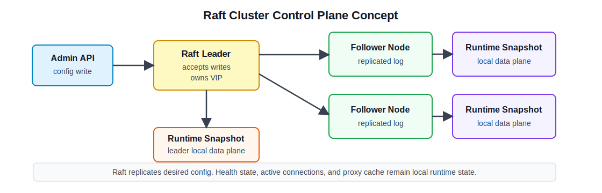

# 8주차 연구노트

## 진행 목표

7주차까지는 단일 노드 로드밸런서에서 reverse proxy, 로드밸런싱 알고리즘, health check, runtime 관측 기능을 구현하였다. 이번 주차에는 단일 노드 구조를 여러 로드밸런서 노드가 함께 동작하는 클러스터 구조로 확장하기 위해 필요한 개념을 조사하였다.

특히 여러 노드가 같은 route와 upstream 설정을 공유하고, 일부 노드가 장애 상태가 되어도 설정 변경과 서비스 진입점이 일관되게 유지되는 구조를 확인하였다. 이를 위해 Raft 기반 분산 합의, leader election, log replication, membership, VIP handover를 클러스터링 PoC의 주요 조사 범위로 두었다.

## 진행 내용

먼저 Raft 논문인 `In Search of an Understandable Consensus Algorithm`을 참고하여 분산 합의 구조를 확인하였다. Raft는 여러 서버가 같은 log를 합의하고, 각 서버의 state machine이 같은 순서로 command를 적용하도록 만드는 알고리즘이다. 논문에서는 Raft를 leader election, log replication, safety로 나누어 설명한다. 이 구조는 프로젝트에서 설정 변경 요청을 한 노드의 로컬 파일 변경으로만 처리하지 않고, leader가 받은 변경 사항을 log로 기록한 뒤 여러 노드가 같은 순서로 적용하는 방식으로 확장할 수 있다.

Raft의 역할 모델도 확인하였다. 노드는 follower, candidate, leader 중 하나의 상태를 가진다. follower가 leader heartbeat를 일정 시간 받지 못하면 candidate가 되고, 과반수 voter의 표를 얻으면 leader가 된다. leader는 client command를 log entry로 만들고 follower에게 복제한다. 이 구조를 로드밸런서에 적용하면 admin write 요청은 leader가 처리하고, follower는 쓰기 요청을 직접 반영하지 않는 방식으로 구성할 수 있다. 이렇게 하면 여러 노드에서 동시에 설정 변경이 발생하더라도 최종 설정 순서를 Raft log 기준으로 맞출 수 있다.

현재 단일 노드 구조는 파일 기반 설정을 중심으로 동작한다. `configs/app.json`은 proxy listen address와 dashboard listen address 같은 프로세스 실행 설정을 담고, `configs/proxy/*.json`은 route와 upstream pool 설정을 담는다. 서버는 이 파일들을 읽어 route table과 upstream registry를 만들고, 요청 처리 시 runtime snapshot을 참조한다. 클러스터링 구조로 확장하려면 이 파일 기반 설정 중 어떤 값을 여러 노드가 공유해야 하고, 어떤 값을 노드별 설정으로 남겨야 하는지 먼저 구분해야 한다.

공유 대상은 route, upstream pool, health check 설정, 로드밸런싱 알고리즘처럼 프록시 동작을 결정하는 설정으로 보았다. 같은 서비스를 구성하는 로드밸런서 노드들은 같은 요청을 같은 규칙으로 해석해야 하므로, 이러한 설정은 Raft log를 통해 복제하는 후보가 된다. 반면 proxy listen address, dashboard listen address, Raft bind address, data directory, 네트워크 interface 같은 값은 노드마다 다를 수 있으므로 로컬 설정으로 남기는 방향을 확인하였다.

runtime 상태는 Raft 복제 대상에서 제외하는 방향으로 확인하였다. 7주차에서 구현한 target별 health 상태, 마지막 health check 오류, Least Connections의 active counter, reverse proxy cache는 각 노드가 실행 중에 관측하거나 계산하는 값이다. 같은 upstream 설정을 공유하더라도 각 로드밸런서 노드가 backend에 접근하는 네트워크 경로와 검사 시점은 다를 수 있다. 따라서 이러한 값은 cluster 전체가 합의해야 하는 설정이 아니라, 각 노드의 local runtime 상태로 유지하는 것이 적절하다고 판단하였다.

설정 저장 구조는 기존 파일 기반 흐름과 Raft 기반 흐름을 분리하는 방식으로 조사하였다. 단일 노드에서는 기존처럼 파일에서 설정을 읽고 runtime snapshot을 만든다. 클러스터 모드에서는 admin API의 설정 변경 요청을 Raft command로 변환하고, leader가 해당 command를 log에 기록한 뒤 각 노드가 같은 순서로 적용하는 구조를 후보로 두었다. 이때 command는 이미 컴파일된 route table이 아니라 namespace, route, upstream pool 같은 사용자의 설정 변경 의도를 표현해야 한다. 그래야 각 노드가 같은 desired config를 기준으로 자신의 runtime snapshot을 다시 만들 수 있다.

Membership 흐름은 bootstrap과 join을 중심으로 확인하였다. 새 클러스터를 만들 때는 하나의 노드가 bootstrap을 수행하고, 이후 다른 노드는 기존 leader에 join 요청을 보내 cluster에 참여한다. Raft에서는 과반수 voter와 통신할 수 있어야 leader election과 log commit이 가능하므로, 노드 수와 장애 허용 범위를 함께 고려해야 한다. 예를 들어 3개 voter로 구성된 cluster는 1개 노드 장애까지는 과반수를 유지할 수 있지만, 2개 노드가 동시에 통신 불가 상태가 되면 설정 변경을 commit할 수 없다. 이 경우 data plane은 마지막으로 적용된 runtime snapshot으로 요청 처리를 계속하되, control plane의 설정 변경은 중단되는 구조가 필요하다.

VIP handover는 Raft leader와 서비스 진입점을 연결하는 기능으로 조사하였다. 현재 leader가 VIP를 점유하고, leader가 장애 상태가 되면 새 leader가 VIP를 점유하는 구조를 고려하였다. 이 방식에서는 VIP가 leader를 선출하는 것이 아니라 Raft leader election 결과를 애플리케이션이 네트워크 interface에 반영한다. leader가 되었을 때 VIP를 추가하고 GARP를 송신하며, leader를 잃었을 때 VIP를 제거하는 흐름이 필요하다. 다만 이 기능은 Linux network capability와 L2 네트워크 환경의 영향을 받으므로, 실제 구현과 검증은 이후 주차에서 별도 테스트 환경을 구성해 진행해야 한다.

라이브러리 후보로는 HashiCorp Raft와 etcd/raft를 확인하였다. etcd/raft는 Raft core에 가까운 라이브러리이며 storage, network transport, application integration을 직접 구성해야 한다. HashiCorp Raft는 `FSM`, `LogStore`, `StableStore`, `SnapshotStore`, `Transport` 같은 인터페이스와 `NewRaft()`, `Apply()`, `AddVoter()`, `LeaderCh()` 같은 API를 제공한다. 이번 프로젝트는 Raft 알고리즘 자체를 새로 구현하는 것이 아니라 로드밸런서에 합의 구조를 임베딩하는 것이 목적이므로, PoC 단계에서는 HashiCorp Raft를 우선 후보로 두는 것이 적합하다고 판단하였다.

## 확인 및 결과

이번 주차에는 클러스터링 PoC에서 가장 먼저 정해야 할 문제가 상태 분리라는 점을 확인하였다. route와 upstream pool처럼 여러 노드가 같은 값을 가져야 하는 설정은 Raft로 복제하는 후보가 된다. 반면 health check 결과, active connection, reverse proxy cache처럼 요청 처리 중에 변하는 값은 각 노드가 로컬에서 관리해야 한다.

또한 클러스터링 구조는 단순히 여러 프로세스를 실행하는 문제가 아니라, 설정 쓰기 권한과 서비스 진입점 소유권을 함께 정의해야 하는 문제라는 점을 확인하였다. 설정 쓰기는 Raft leader를 기준으로 처리하고, VIP 점유도 leader 상태와 연결하는 방향이 적합하다. 다만 8주차에서는 이 구조를 실제로 구현하기보다, 어떤 기능을 어떤 순서로 구현할지 조사하고 PoC 범위를 나누는 데 집중하였다.

다음 구현 단계에서는 먼저 Raft를 프로젝트에 임베딩하고, 설정 변경 command를 Raft log에 기록한 뒤 runtime snapshot으로 반영하는 구조를 만들어야 한다. VIP 점유와 장애조치는 Raft leader transition이 안정적으로 확인된 뒤 구현하는 것이 적절하다.

## 다음 주차 계획

9주차에는 HashiCorp Raft 라이브러리를 프로젝트 구조에 연결할 계획이다. Raft node 생성, FSM apply, snapshot/restore, leader-only write 처리, membership 처리를 우선 구현 범위로 둔다.

또한 기존 파일 기반 설정 구조를 바로 제거하지 않고, Raft 기반 설정 저장 구조와 어떻게 분리할지 확인한다. 이때 cluster-wide 설정과 local runtime 상태가 섞이지 않도록 8주차에서 조사한 상태 분리 기준을 적용한다.

## 관련 문서

- [In Search of an Understandable Consensus Algorithm](https://www.usenix.org/conference/atc14/technical-sessions/presentation/ongaro)
- [The Raft Consensus Algorithm](https://raft.github.io/)
- [HashiCorp Raft Go Package](https://pkg.go.dev/github.com/hashicorp/raft)
- [etcd-io/raft](https://github.com/etcd-io/raft)
