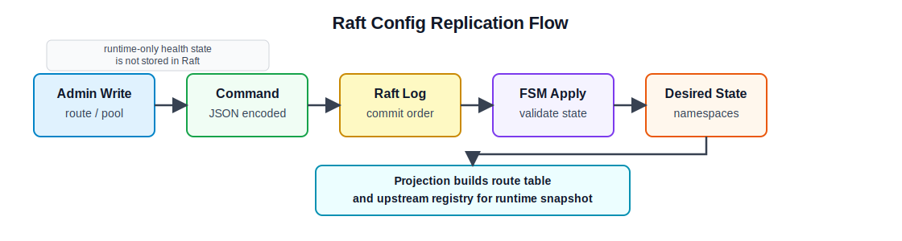

# 9주차 연구노트

## 진행 목표

8주차에는 단일 노드 로드밸런서 구조를 클러스터 구조로 확장하기 위해 Raft, membership, VIP handover 개념을 조사하였다. 이번 주차에는 조사 내용을 바탕으로 HashiCorp Raft를 프로젝트에 임베딩하고, 프록시 설정 변경을 Raft log와 FSM을 통해 관리하는 1차 구현을 진행하였다.

이번 주차의 핵심은 Raft를 요청 분산 알고리즘에 직접 연결하는 것이 아니라, 여러 로드밸런서 노드가 공유해야 하는 설정 상태를 일관되게 복제하는 구조를 만드는 것이었다. 따라서 route, upstream pool, namespace 같은 설정 목표 상태를 Raft의 관리 대상으로 두고, health 상태와 active connection 같은 요청 처리 중 상태는 각 노드의 로컬 runtime 상태로 남기는 방향으로 구현하였다.

## 진행 내용

먼저 `hashicorp/raft`와 `etcd/raft`의 적용 방식을 비교하였다. `etcd/raft`는 Raft core에 가까운 라이브러리라서 storage, transport, tick 처리, message 전송을 애플리케이션이 더 직접적으로 구성해야 한다. 반면 `hashicorp/raft`는 `FSM`, `LogStore`, `StableStore`, `SnapshotStore`, `Transport` 같은 인터페이스를 제공하고, `raft.NewRaft()`와 `raft.Apply()`를 통해 애플리케이션 command를 Raft log에 기록할 수 있다. 이번 프로젝트는 Raft 알고리즘 자체 구현보다 로드밸런서 설정 복제가 목적이므로, 1차 구현에서는 `hashicorp/raft`를 사용하였다.

Raft가 담당할 상태 범위는 프록시 설정의 목표 상태로 제한하였다. 기존 단일 노드 구조에서는 `configs/proxy/*.json`에 있는 route와 upstream pool을 읽어 runtime snapshot을 만들었다. 클러스터 구조에서는 이 설정을 각 노드의 로컬 파일 변경으로 따로 관리하면 노드마다 다른 설정을 가질 수 있다. 따라서 namespace, route, upstream pool 변경을 Raft command로 표현하고, leader가 command를 commit하면 각 노드의 FSM이 같은 순서로 적용하도록 하였다. 반면 target health, round-robin cursor, least-connection active counter, reverse proxy cache는 요청 처리 중에 변하는 값이므로 Raft command에 포함하지 않았다.

설정 변경 command는 `internal/raft/command.go`에 정의하였다. `CommandType`에는 `create_namespace`, `delete_namespace`, `replace_namespace_config`, `create_route`, `update_route`, `delete_route`, `create_upstream_pool`, `update_upstream_pool`, `delete_upstream_pool`을 두었다. `Command` 구조체는 command 종류와 namespace, route id, pool id, route body, upstream pool body를 함께 담는다. `EncodeCommand()`와 `DecodeCommand()`는 command를 JSON으로 직렬화하고 역직렬화한다. 이 방식은 Raft log에 Go runtime 객체가 아니라 사용자의 설정 변경 의도를 저장하기 위한 것이다.

Raft FSM은 `internal/raft/fsm.go`에 구현하였다. `FSM`은 현재 desired state를 메모리에 보관하고, `Apply()`에서 Raft log에 들어온 command를 해석한다. `Apply()`는 먼저 command를 decode하고, 현재 state를 복사한 뒤 `applyCommand()`로 변경 사항을 반영한다. 이후 전체 desired state를 검증하고, route table과 upstream registry로 projection 가능한지 확인한 뒤에만 state를 교체한다. 이 절차를 둔 이유는 잘못된 route나 존재하지 않는 upstream pool 참조가 Raft log에 commit된 뒤 runtime snapshot 생성에 실패하는 상황을 줄이기 위해서다.

`applyCommand()`에서는 command 종류별로 설정 변경 로직을 분리하였다. namespace 생성은 이미 같은 namespace가 있으면 conflict로 처리하고, 삭제는 존재하지 않는 namespace이면 not found로 처리한다. upstream pool 삭제에서는 해당 pool을 참조하는 route가 남아 있으면 삭제하지 않도록 하였다. route 수정에서는 요청 경로의 route id와 body의 route id가 다르면 invalid request로 처리하였다. 이 검증은 단일 노드 파일 기반 설정에서 하던 기본 검증을 Raft command 적용 과정에서도 유지하기 위한 것이다.

Snapshot과 restore는 `internal/raft/fsm_snapshot.go`에서 구현하였다. `FSM.Snapshot()`은 현재 desired state를 복사해 `raft.FSMSnapshot`으로 만들고, `Persist()`는 이 state를 JSON으로 snapshot sink에 저장한다. `Restore()`는 snapshot을 다시 읽어 FSM state로 복원한다. Raft log가 계속 쌓이면 모든 log를 처음부터 재생하는 비용이 커질 수 있으므로, snapshot은 현재 설정 상태를 빠르게 복원하기 위한 장치로 사용된다. 이때 snapshot에도 health check 결과나 active counter 같은 runtime 값은 포함하지 않았다.

Raft node 생성은 `internal/raft/node.go`에서 구현하였다. `NodeOptions`에는 node id, bind address, advertise address, data dir, bootstrap 여부, FSM을 넣었다. `NewNode()`는 data dir을 준비하고, `raft-boltdb` 기반 log store와 stable store를 만들며, file snapshot store와 TCP transport를 구성한다. 이후 `raft.NewRaft()`로 Raft node를 생성한다. 기존 Raft state가 없고 bootstrap 설정이 있으면 자기 자신을 포함한 single-node cluster로 bootstrap한다. 이 구조를 통해 단일 노드도 Raft cluster로 시작할 수 있고, 이후 membership 확장으로 여러 노드를 붙일 수 있는 기반을 마련하였다.

설정 저장소 역할은 `internal/raft/store.go`에서 구현하였다. `Store`는 admin API가 직접 Raft 객체를 다루지 않도록 감싸는 역할을 한다. 설정 변경 요청이 들어오면 `ensureLeaderWrite()`로 현재 노드가 leader인지 확인하고, leader가 아니면 `not_raft_leader` 성격의 오류를 반환한다. leader인 경우에는 command를 encode한 뒤 `raft.Apply()`를 호출한다. apply 결과에서 FSM이 validation error나 conflict를 반환하면 HTTP 상태 코드와 오류 코드로 변환할 수 있도록 하였다. 이 구조는 이후 dashboard나 admin API에서 follower write를 구분하는 데 사용할 수 있다.

마지막으로 Raft를 적용하더라도 요청 처리 경로는 계속 runtime snapshot을 읽도록 두었다. Raft는 설정 변경을 합의하고 desired state를 복제하는 control plane 역할을 한다. 실제 클라이언트 요청을 어떤 backend로 보낼지 결정하는 data plane은 각 노드의 route table, upstream registry, health 상태를 사용한다. 이 구분을 유지해야 설정 변경은 강한 일관성을 갖고, 요청 처리 경로는 Raft write path에 묶이지 않는다.

## 확인 및 결과

이번 주차 작업을 통해 Raft가 프로젝트에서 담당할 역할을 구체화하였다. Raft는 모든 실행 상태를 공유하는 도구가 아니라, 여러 노드가 동일하게 가져야 하는 프록시 설정 변경을 같은 순서로 적용하기 위한 저장 및 합의 계층으로 사용된다. route와 upstream pool은 Raft command와 FSM state에 포함되지만, health 상태와 active connection은 로컬 runtime 상태로 유지된다.

HashiCorp Raft를 사용하면서 필요한 구성 요소도 확인하였다. FSM은 command를 적용하는 state machine이고, log store와 stable store는 Raft log와 term/vote 같은 안정 저장 정보를 보관한다. snapshot store는 현재 desired state를 저장해 복구 비용을 줄인다. transport는 노드 간 Raft RPC를 주고받는 역할을 한다. 이 구성 요소를 프로젝트 안에 연결하면서, Raft node를 실행하기 위한 기본 구조를 마련하였다.

다만 이번 주차의 구현은 Raft 기반 설정 복제의 출발점에 해당한다. 아직 VIP 점유, leader 변경 시 서비스 진입점 이동, 멀티 노드 장애 테스트까지 완성한 것은 아니다. 다음 단계에서는 Raft leader 상태를 외부 기능과 연결하고, 실제 여러 노드에서 설정 변경과 leader election이 의도대로 동작하는지 확인해야 한다.

## 다음 주차 계획

10주차에는 Raft leader election 결과를 고가용성 진입점과 연결하는 작업을 진행할 계획이다. 이를 위해 Keepalived의 VIP와 failover 구조를 조사하고, Raft leader가 되었을 때 VIP를 점유하고 leader가 아니게 되었을 때 VIP를 해제하는 흐름을 구현한다.

또한 VIP 점유는 단순한 설정 복제가 아니라 Linux network interface와 ARP 전파를 다루는 기능이므로, 필요한 권한과 실행 환경 조건도 함께 확인한다. 이 작업은 11주차의 멀티 노드 Raft 및 VIP 점유 테스트로 이어진다.

## 관련 문서

- [HashiCorp Raft Go Package](https://pkg.go.dev/github.com/hashicorp/raft)
- [etcd-io/raft](https://github.com/etcd-io/raft)
- [Raft command 구현](../../internal/raft/command.go)
- [Raft FSM 구현](../../internal/raft/fsm.go)
- [Raft FSM snapshot 구현](../../internal/raft/fsm_snapshot.go)
- [Raft node 구현](../../internal/raft/node.go)
- [Raft store 구현](../../internal/raft/store.go)
