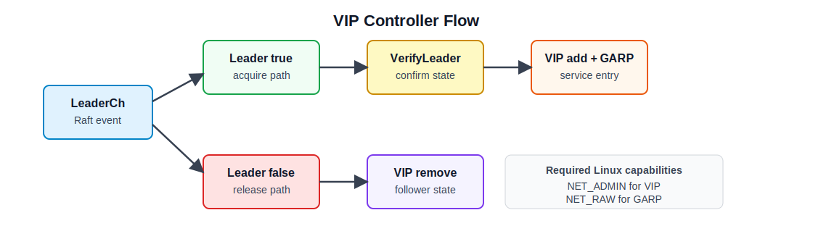

# 10주차 연구노트

## 진행 목표

9주차에는 Raft를 프로젝트에 임베딩하고, route와 upstream pool 같은 프록시 설정을 Raft log와 FSM으로 복제하는 구조를 구현하였다. 이번 주차에는 Raft leader election 결과를 서비스 진입점 관리와 연결하였다.

구체적으로는 Keepalived의 VIP와 VRRP 기반 failover 개념을 확인하고, 프로젝트에서는 별도의 VRRP 프로토콜을 구현하지 않고 Raft leader가 VIP를 점유하는 방식으로 설계하였다. 이번 주차의 목표는 leader가 되었을 때 VIP를 Linux interface에 추가하고, leader 상태를 잃었을 때 VIP를 제거하는 기본 흐름을 구현하는 것이었다.

## 진행 내용

먼저 Keepalived의 구조를 확인하였다. Keepalived는 크게 LVS 기반 load balancing 기능과 VRRP 기반 high availability 기능을 제공한다. 이 중 이번 주차와 직접 관련된 부분은 VRRP를 이용한 failover 구조다. VRRP에서는 여러 노드 중 하나가 MASTER 상태가 되어 VIP를 소유하고, BACKUP 노드는 MASTER 장애 시 VIP를 이어받을 수 있다. 클라이언트는 개별 노드 IP가 아니라 VIP로 접근하므로, VIP 소유 노드가 바뀌어도 서비스 진입점은 같은 주소로 유지된다.

프로젝트에서는 Keepalived의 VRRP 프로토콜을 그대로 구현하지 않았다. 이미 9주차에 Raft leader election을 도입했기 때문에, leader를 다시 뽑기 위한 별도 프로토콜을 추가하면 리더십 기준이 두 개가 된다. 따라서 Raft가 leader election과 quorum 판단을 담당하고, 애플리케이션은 그 leader 상태를 Linux VIP 점유로 반영하는 구조를 선택하였다. 이 방식에서는 Raft leader가 VIP owner가 되고, follower는 VIP를 소유하지 않는다.

VIP controller는 `internal/vip/controller.go`에 구현하였다. `Controller`는 `Leadership`, `Manager`, `Announcer` 인터페이스를 사용한다. `Leadership`은 Raft leader 상태 변화를 전달하고, `Manager`는 VIP 주소를 interface에 추가하거나 제거하며, `Announcer`는 GARP를 송신한다. 이렇게 인터페이스를 나눈 이유는 leader 상태 감지, 주소 조작, ARP 송신을 하나의 함수에 섞지 않고 각각 테스트할 수 있도록 하기 위해서다.

`Controller.Run()`은 `LeaderCh()`에서 leader 상태 이벤트를 받는다. `LeaderCh(true)`가 들어오면 acquire 흐름을 실행하고, `LeaderCh(false)`가 들어오면 release 흐름을 실행한다. 종료 시에는 `ReleaseOnShutdown` 설정에 따라 VIP를 제거한다. 이번 주차에는 leader 상태 변화에 따라 VIP를 추가하거나 제거하는 기본 흐름을 구현하는 데 집중하였다.

VIP acquire 흐름은 `reacquire()`와 `acquire()`에서 처리하였다. 노드가 leader가 되면 먼저 필요한 경우 기존 VIP를 release하고, `AcquireDelay`만큼 대기한다. 그 다음 `VerifyLeader()`를 호출해 아직 leader 상태인지 확인한다. leader 확인이 실패하면 VIP를 추가하지 않는다. leader 확인이 성공하면 `manager.Add()`로 interface에 VIP를 추가하고, `announcer.Announce()`로 GARP를 송신한다. 이 순서를 둔 이유는 leader transition 직후의 짧은 상태 변화를 한 번 더 확인하고, VIP가 추가된 뒤 주변 장비나 클라이언트의 ARP cache가 새 owner를 학습할 수 있도록 하기 위해서다.

VIP release 흐름은 follower로 전환되거나 controller가 종료될 때 `manager.Remove()`를 호출하여 interface에서 VIP를 제거하는 방식으로 구성하였다. 제거가 성공하면 controller 내부의 `owned` 상태를 false로 바꾸고 마지막 오류를 비운다. 오류가 발생하면 `lastError`에 기록하여 상태 조회에서 확인할 수 있도록 하였다. 이 구조는 VIP 점유 여부와 마지막 실패 원인을 runtime 상태로 볼 수 있게 한다.

Linux에서 VIP 주소를 실제로 조작하는 부분은 `internal/vip/netlink_linux.go`에 구현하였다. `NewNetlinkManager()`는 interface 이름과 CIDR 형식의 VIP 주소를 받아 `NetlinkManager`를 만든다. 주소는 IPv4 CIDR인지 확인한다. `Add()`는 `netlink.LinkByName()`으로 interface를 찾고, `AddrList()`로 이미 같은 주소가 있는지 확인한 뒤 없을 때만 `AddrAdd()`를 호출한다. `Remove()`도 같은 방식으로 주소 존재 여부를 확인한 뒤 `AddrDel()`을 호출한다. 이 방식은 같은 이벤트가 반복되어도 중복 추가나 불필요한 삭제가 발생하지 않도록 한다.

GARP 송신은 `internal/vip/arp_linux.go`에 구현하였다. `NewARPAnnouncer()`는 interface와 VIP 주소, 반복 횟수, 간격을 받아 announcer를 만든다. `Announce()`는 ARP client를 열고, VIP 주소와 interface MAC 주소를 이용해 ARP reply packet을 만든 뒤 broadcast 주소로 전송한다. `writeAnnouncements()`는 설정된 횟수만큼 packet을 보내고, 각 전송 사이에 interval을 둔다. GARP는 VIP owner가 바뀌었을 때 같은 L2 네트워크의 ARP cache가 새 MAC 주소를 더 빨리 알 수 있도록 하기 위한 절차다.

운영 제약도 함께 확인하였다. VIP add/remove는 Linux network interface를 조작하므로 `CAP_NET_ADMIN` 권한이 필요하다. GARP 송신은 raw socket을 사용하므로 `CAP_NET_RAW` 권한이 필요하다. 또한 VIP 이동은 L2 네트워크와 ARP cache의 영향을 받는다. Docker bridge 내부에서는 컨테이너 간 동작을 확인할 수 있지만, 외부 장비의 ARP cache 갱신까지 확인하려면 Linux host나 Linux VM에서 같은 L2 segment를 구성해야 한다.

## 확인 및 결과

이번 주차 작업을 통해 Raft leader와 VIP owner를 연결하는 기본 구조를 구현하였다. Keepalived는 VRRP를 통해 MASTER/BACKUP 상태를 관리하지만, 프로젝트에서는 Raft가 이미 leader election을 담당하므로 VRRP 선출 프로토콜을 별도로 구현하지 않았다. 대신 Raft leader 상태를 VIP acquire/release의 입력으로 사용하였다.

구현 결과 `Controller`는 leader 상태 변화에 따라 VIP를 추가하거나 제거하고, VIP 추가 후 GARP를 송신하는 흐름을 가진다. `NetlinkManager`는 Linux interface의 IPv4 VIP 주소를 관리하고, `ARPAnnouncer`는 VIP owner 변경을 네트워크에 알리는 역할을 한다. 각 구성 요소를 인터페이스로 분리했기 때문에 controller 로직은 fake manager와 fake announcer로 단위 테스트할 수 있고, Linux 권한이 필요한 실제 netlink/ARP 동작은 별도 환경에서 확인할 수 있다.

이번 주차 구현은 Raft leader 기반 VIP 점유의 기본 흐름을 만든 것이다. 아직 여러 노드를 동시에 실행해 leader 장애 시 VIP가 새 leader로 넘어가는지 확인한 것은 아니다. 실제 장애조치 동작은 11주차에 멀티 노드 환경을 구성하여 확인할 계획이다.

## 다음 주차 계획

11주차에는 Raft cluster와 VIP controller를 함께 실행하는 멀티 노드 테스트 환경을 구성한다. 세 개의 proxy 노드를 구성하고, leader가 VIP를 보유하는지, follower는 VIP를 보유하지 않는지 확인한다.

또한 leader를 중단했을 때 새 leader가 선출되고 VIP를 획득하는지 확인한다. 테스트 과정에서는 VIP 소유 여부, client 요청 성공 여부, ARP/GARP 전파 한계를 함께 확인한다.

## 관련 문서

- [Keepalived Introduction](https://keepalived.readthedocs.io/en/latest/introduction.html)
- [Keepalived Terminology](https://keepalived.readthedocs.io/en/latest/terminology.html)
- [Keepalived Failover using VRRP](https://keepalived.readthedocs.io/en/latest/case_study_failover.html)
- [VIP Controller 구현](../../internal/vip/controller.go)
- [Linux Netlink VIP 구현](../../internal/vip/netlink_linux.go)
- [GARP Announcer 구현](../../internal/vip/arp_linux.go)
- [VIP runtime 설정](../../internal/vip/runtime/config.go)
