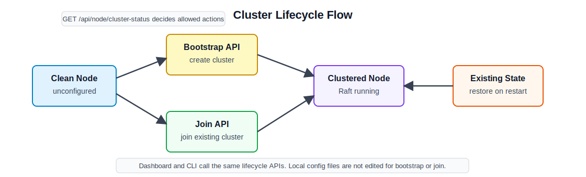

# 14주차 연구노트

## 진행 목표

13주차에는 Raft timing 값을 조정하여 VIP failover 시간을 줄이고, hard kill 상황에서 stale VIP가 남을 수 있다는 점을 확인하였다. 이번 주차에는 클러스터링 기능 중 운영 흐름에서 부족했던 부분을 보완하였다. 핵심은 로드밸런서 노드를 실행한 뒤 파일을 직접 수정하지 않고도 cluster를 만들고, 다른 노드를 join시키고, 현재 상태를 확인할 수 있게 하는 것이다.

9주차에는 기존 Raft state가 없고 bootstrap 설정이 있으면 단일 노드 cluster를 만들 수 있는 기본 부팅 경로를 구현하였다. 이 방식은 테스트에는 사용할 수 있지만, 운영자가 여러 노드를 순차적으로 구성하거나 timing 값을 cluster 단위로 맞추기에는 불편하다. 따라서 이번 주차에는 clean node를 먼저 control-plane으로 띄우고, API나 CLI, dashboard를 통해 bootstrap/join을 명시적으로 수행하는 방식으로 변경하였다.

## 진행 내용

먼저 clean node의 시작 동작을 변경하였다. 기존 Raft state가 없는 노드는 실행 직후 자동으로 Raft cluster를 만들지 않고, dashboard와 control-plane API만 준비된 `unconfigured` 상태로 시작한다. 이 상태에서는 proxy 설정 쓰기 요청을 받을 수 없으며, 설정 쓰기 요청은 `cluster_not_configured` 오류로 거부된다. 반대로 기존 Raft data dir이 있는 노드는 재시작 시 기존 state를 사용하여 cluster 상태를 복원한다. 이 구분을 통해 새 cluster 생성과 기존 cluster 복구가 섞이지 않도록 하였다.

현재 노드의 lifecycle 상태는 `GET /api/node/cluster-status`로 확인할 수 있게 하였다. 이 API는 현재 노드가 `unconfigured`, `clustered`, `existing_state` 중 어떤 상태인지 반환한다. 또한 Raft data dir 존재 여부, Raft node 실행 여부, bootstrap 가능 여부, join 가능 여부를 함께 제공한다. 운영자는 이 응답을 보고 현재 노드에서 cluster를 새로 만들 수 있는지, 기존 cluster에 join할 수 있는지 먼저 확인할 수 있다.

cluster 생성은 `POST /api/cluster/bootstrap`으로 수행하도록 하였다. bootstrap 요청에는 `node_id`, `raft_bind_addr`, `raft_advertise_addr`를 포함하고, VIP를 사용할 경우 `vip_interface`와 VIP address를 함께 전달한다. bootstrap이 성공하면 해당 노드는 Raft leader로 시작하고, VIP address와 GARP 정책은 Raft desired state에 저장된다. VIP interface는 노드마다 다를 수 있으므로 cluster-wide 값이 아니라 node-local 입력으로 유지하였다.

다른 노드의 join 흐름은 `POST /api/node/join-cluster`로 분리하였다. join node는 자신의 `node_id`, Raft address, VIP interface, 기존 cluster admin URL 후보를 전달한다. 이 API는 local node에서 Raft node를 시작한 뒤, peer 후보를 순회하여 leader의 `/api/cluster/join`에 membership 추가 요청을 보낸다. 기존 `/api/cluster/join`은 leader가 새 voter를 추가하는 membership API로 유지하고, `/api/node/join-cluster`는 운영자가 join node에서 호출하는 lifecycle API로 구분하였다.

Raft timing 입력 방식도 함께 변경하였다. 13주차에서 M3 `2500ms/4s/2s/250ms`가 권장값으로 확인되었기 때문에, timing 값은 정적 app config 파일보다 cluster 생성 시 입력되는 값으로 관리하는 편이 적합하다. bootstrap 요청은 선택적으로 `raft_timing` 객체를 받을 수 있고, 이 값은 leader의 Raft node 시작 설정에 반영된 뒤 Raft desired state에도 저장된다. 이렇게 하면 cluster 전체가 같은 heartbeat, election, leader lease, commit timeout 기준을 공유할 수 있다.

join node가 timing 값을 맞추는 흐름도 보완하였다. join node는 Raft node를 시작하기 전에 peer 후보의 `GET /api/cluster`를 조회하여 cluster-wide Raft timing을 가져온다. timing 정보가 있으면 join node는 해당 값을 사용해 local Raft node를 시작한다. peer가 timing 정보를 제공하지 않는 경우에는 기존 기본값으로 join할 수 있게 하였고, 모든 peer 조회가 실패하면 Raft node를 시작하지 않고 join을 실패 처리하도록 하였다. 이를 통해 cluster 안의 노드들이 서로 다른 timing으로 시작하는 문제를 줄였다.

운영자가 웹에서 같은 흐름을 실행할 수 있도록 dashboard lifecycle 화면도 추가하였다. `/cluster-lifecycle` 화면은 `GET /api/node/cluster-status`로 현재 노드 상태를 보여주고, bootstrap form과 join form에서 각각 lifecycle API를 호출한다. 이 화면은 기존 route/upstream 편집용 SPA를 바꾸지 않고 별도 HTML 화면으로 추가하였다. 기존 프론트엔드 source가 없는 상태였기 때문에, 대시보드 번들을 직접 재빌드하지 않고 운영용 진입점을 분리하는 방식을 선택하였다.

CLI에서도 같은 lifecycle 흐름을 사용할 수 있도록 하였다. 운영자는 `reverseproxy cluster status`로 노드 상태를 확인하고, `reverseproxy cluster bootstrap`으로 첫 노드를 leader로 만들며, `reverseproxy cluster join`으로 다른 노드를 cluster에 합류시킬 수 있다. CLI는 local config 파일을 수정하지 않고 dashboard API를 호출하는 방식으로 동작한다. 따라서 웹, CLI, API가 모두 같은 lifecycle API를 기준으로 cluster 생성과 가입을 수행한다.

구현 과정에서 Raft identity, Raft timing, VIP config의 책임도 분리하였다. `configs/app.json`은 proxy listen address, dashboard listen address, data dir처럼 프로세스를 실행하는 데 필요한 node-local 설정만 담당한다. Raft node identity는 bootstrap/join 요청과 local metadata로 관리하고, Raft timing은 bootstrap 요청과 Raft desired state로 관리한다. VIP address와 GARP 정책은 cluster-wide desired state에 저장하지만, VIP interface는 node-local 값으로 유지한다. 이 분리를 통해 정적 파일이 cluster 정책을 소유하는 것처럼 보이는 문제를 줄였다.

## 확인 및 결과

이번 주차 작업을 통해 cluster lifecycle이 더 명확해졌다. clean node는 실행만으로 cluster를 만들지 않고 `unconfigured` 상태로 대기한다. 운영자는 상태 조회 API로 현재 노드의 상태를 확인한 뒤 bootstrap 또는 join을 명시적으로 실행한다. 기존 Raft state가 있는 노드는 새 cluster를 만들지 않고 기존 state를 복원한다. 이 흐름은 실수로 새로운 cluster를 만들거나, 기존 state가 있는 노드를 다른 cluster에 잘못 join시키는 위험을 줄인다.

Raft timing 관리 방식도 개선되었다. 13주차에서 확인한 것처럼 timing 값은 failover 시간과 election 안정성에 직접 영향을 준다. 따라서 각 노드의 파일에 따로 적어 두는 방식보다, bootstrap 시 cluster-wide 정책으로 저장하고 join node가 이를 조회해 사용하는 방식이 더 적합하다. 이 구조에서는 운영자가 M3 권장값 같은 timing profile을 cluster 생성 시 한 번 입력하고, 이후 join node는 같은 값을 따라간다.

VIP 설정도 역할이 분명해졌다. VIP address와 GARP 정책은 cluster 전체가 공유해야 하는 값이므로 Raft desired state에 저장한다. 반면 interface 이름은 노드 환경마다 다를 수 있으므로 local lifecycle 입력으로 남긴다. 이 구분은 OpenStack, Docker, Linux VM처럼 interface 이름이 다른 환경에서도 같은 cluster-wide VIP 정책을 유지할 수 있게 한다.

dashboard와 CLI는 같은 API를 사용하도록 맞추었다. 웹 화면은 운영자가 노드 상태를 보고 bootstrap/join을 실행하는 간단한 control-plane 역할을 한다. CLI는 자동화나 원격 운영에서 같은 API를 호출하는 도구 역할을 한다. 이로써 cluster 생성과 가입을 파일 수정, 웹 조작, CLI 조작이 서로 다른 의미로 수행하는 문제가 줄어들었다.

다만 아직 운영 기능이 완전히 끝난 것은 아니다. running cluster의 timing을 동적으로 변경하는 기능은 포함하지 않았다. 또한 장시간 down된 voter를 자동으로 제거하거나, non-voter로 먼저 catch-up한 뒤 voter로 승격하는 기능도 남아 있다. 이번 주차에서는 cluster를 만들고 join시키는 기본 운영 흐름을 명확히 하는 데 집중하였다.

## 다음 주차 계획

15주차에는 통합 테스트를 진행한다. 프로젝트 구현의 HA L7 로드밸런서와 Nginx, SpringBoot backend, Keepalived, CephFS 기반 대조군 환경을 함께 구성하고, 정상 요청 처리와 장애 상황을 비교한다.

테스트 기준은 단순 처리량뿐 아니라 상태 전파 시간, leader 장애 후 failover 시간, backend 장애 시 요청 처리, 노드 재시작 후 복구 여부를 포함한다. 14주차에서 정리한 lifecycle API와 dashboard/CLI 흐름은 통합 테스트 환경을 구성하고 반복 실행하는 데 사용한다.

## 관련 문서

- [Dashboard API](../api/dashboard-api.ko.md)
- [Dashboard Frontend API Migration Guide](https://github.com/lb-ajou/reverseproxy-poc/blob/main/docs/api/dashboard-frontend-api-migration.ko.md)
- [아키텍처 상세 설명](../architecture/architecture.ko.md)
- [Raft Config State](../architecture/raft-config-state.ko.md)
- [Raft HA 구현 요약](https://github.com/lb-ajou/reverseproxy-poc/blob/main/docs/architecture/raft-ha-implementation-summary.ko.md)
- [VIP Failover](https://github.com/lb-ajou/reverseproxy-poc/blob/main/docs/new-repo/vip-failover.ko.md)
- [Raft and Membership](https://github.com/lb-ajou/reverseproxy-poc/blob/main/docs/new-repo/raft-and-membership.ko.md)
