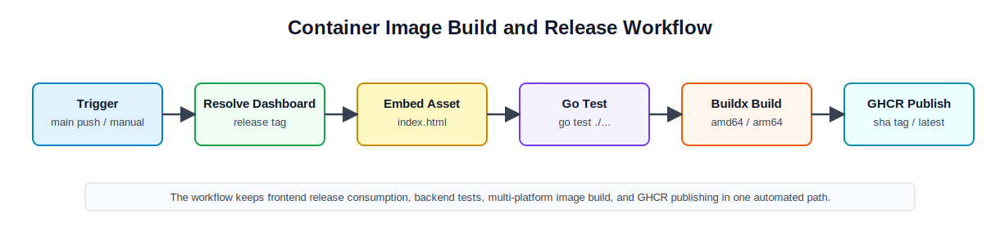

# 16주차 연구노트

## 진행 목표

15주차에는 Raft cluster, VIP failover, Dashboard/API를 함께 놓고 통합 테스트 관점에서 전체 동작을 확인하였다. 이번 주차에는 컨테이너 이미지 빌드 환경을 구성하고, GitHub Actions 기반 이미지 빌드 및 배포 파이프라인을 작성하였다.

이번 주차의 핵심은 로드밸런서 실행 파일과 Dashboard 정적 파일을 하나의 배포 가능한 이미지로 묶고, 변경 사항이 `main` branch에 반영되면 GitHub Container Registry에 이미지를 자동으로 게시하는 흐름을 만드는 것이었다. 또한 지금까지 진행한 로드밸런싱 PoC, 알고리즘 구현, 성능 비교, Raft clustering, VIP failover, 통합 테스트 결과를 최종 결과 보고서에 반영할 수 있도록 정리하였다.

## 진행 내용

먼저 컨테이너 실행에 필요한 최소 요구사항을 정리하였다. 로드밸런서는 proxy port와 dashboard port를 열어야 하고, 실행 설정 파일과 Raft data directory를 컨테이너 외부에서 관리할 수 있어야 한다. 이에 맞춰 기본 설정의 data directory를 컨테이너 볼륨으로 연결하기 쉬운 경로로 정리하고, 이후 배포 문서에 반영하였다.

Dockerfile은 multi-stage build 구조로 구성하였다. builder stage에서는 Go `1.26.3` Alpine 이미지를 사용해 `main.go`와 `internal/` package를 빌드하고, runtime stage에는 빌드된 `loadbalancer` binary만 복사한다. 이때 Buildx가 전달하는 `TARGETOS`, `TARGETARCH` 값을 Go build에 연결하여 `linux/amd64`와 `linux/arm64` 이미지를 같은 Dockerfile로 만들 수 있게 하였다. 이전처럼 특정 architecture가 고정되어 있으면 GitHub Actions에서 multi-platform image를 만들 때 대상 platform과 실제 binary architecture가 어긋날 수 있으므로, 빌드 대상 정보를 Dockerfile에 명시적으로 반영하였다.

Dashboard 정적 파일 포함 방식도 정리하였다. loadbalancer repository 안에서 frontend를 다시 빌드하지 않고, 별도 `dashboard-frontend` repository가 GitHub Release로 게시한 `index.html` asset을 가져와 `internal/dashboard/static/index.html`에 복사한 뒤 Go binary를 빌드하도록 하였다. 이 방식은 frontend build 책임과 loadbalancer image build 책임을 분리한다. 또한 수동 workflow 실행 시 특정 dashboard release tag를 지정할 수 있게 하여, 필요한 경우 어떤 Dashboard 산출물을 포함한 이미지인지 재현할 수 있도록 하였다.

GitHub Actions workflow는 `main` branch push와 `workflow_dispatch`를 기준으로 실행되도록 구성하였다. workflow는 먼저 loadbalancer repository를 checkout하고 Go toolchain을 설정한다. 이후 `dashboard_release_tag` 입력이 있으면 해당 release를 사용하고, 입력이 없으면 `lb-ajou/dashboard-frontend`의 최신 release tag를 조회한다. release asset으로 내려받은 `index.html`이 비어 있으면 빌드를 중단하고, 정상 파일이면 loadbalancer의 embedded static asset 위치로 복사한다.

정적 파일을 반영한 뒤에는 `go test ./...`를 먼저 실행한다. 테스트가 실패하면 Docker image build와 registry push까지 진행하지 않도록 하여, 깨진 상태의 image가 게시되는 것을 막는다. 테스트를 통과하면 QEMU와 Docker Buildx를 설정하고, GitHub Container Registry에 로그인한 뒤 `linux/amd64`, `linux/arm64` image를 빌드한다. image tag는 loadbalancer commit을 추적할 수 있도록 `sha-<short_sha>` 형식을 사용하고, 기본 실행 예제를 단순하게 유지하기 위해 `latest` tag도 함께 게시하도록 하였다.

기본 실행 흐름도 간단히 보강하였다. 최종 사용자가 바로 컨테이너 이미지를 실행해 볼 수 있도록 root `compose.yaml`을 추가하고, 로컬 `configs/` directory와 Raft data volume을 연결하였다. README에는 Docker build, Docker run, Compose 실행 방법을 반영하였다. 이 부분은 최종 배포 절차를 설명하기 위한 보조 작업이며, 기존 HA 검증용 compose 시나리오와는 별도의 단일 노드 기본 실행 예제로 정리하였다.

마지막으로 최종 결과 보고서에 들어갈 내용을 정리하였다. 보고서에서는 초반부에 연구 주제와 자체 L7 로드밸런서 구현 범위를 설명하고, 중반부에는 routing algorithm, health check, Dashboard/API, benchmark 결과를 정리한다. 후반부에는 Raft 기반 설정 복제, leader 기반 VIP ownership, failover 테스트, 통합 테스트, 컨테이너 이미지 배포 자동화까지 연결해 프로젝트가 단일 노드 PoC에서 고가용성 배포 단위로 확장된 과정을 설명하도록 구성하였다.

## 검토 및 결과

이번 주차 작업을 통해 최종 배포 산출물을 만들기 위한 자동화 흐름을 마련하였다. GitHub Actions는 Dashboard release asset을 가져와 binary에 포함하고, Go test를 통과한 뒤 multi-architecture image를 GHCR에 게시한다. 따라서 로드밸런서 backend와 Dashboard frontend를 각각의 repository에서 관리하면서도, 최종 배포 이미지는 하나의 산출물로 제공할 수 있게 되었다.

Dockerfile도 배포 관점에서 단순해졌다. runtime image에는 실행 binary만 포함되며, 실행 시 필요한 설정은 외부 config mount로 제공된다. Raft data는 volume으로 분리되므로 컨테이너를 재시작하더라도 local node state를 유지할 수 있다. 이 구조는 단일 노드 기본 실행뿐 아니라 이후 운영 환경에서 volume과 config를 분리해 관리하는 방식으로 확장할 수 있다.

다만 현재 최종 배포 자동화는 image build와 publish에 초점을 둔다. 실제 3-node HA cluster를 운영 환경에 배포하려면 node별 Raft advertise address, VIP interface, network capability, L2 network 조건을 별도로 맞춰야 한다. 또한 GHCR push는 GitHub Actions 권한과 registry 설정에 의존하므로, 최종 확인은 workflow 실행 결과와 package 게시 상태를 함께 확인해야 한다.

최종 결과 보고서 작성 측면에서는 전체 프로젝트 흐름을 하나로 연결할 수 있는 기준을 마련하였다. 프로젝트는 단순 HTTP reverse proxy 구현에서 출발했지만, 최종적으로는 설정 복제, 장애조치, Dashboard 기반 운영 확인, 컨테이너 이미지 배포 자동화까지 포함하는 HA L7 로드밸런서 PoC로 정리할 수 있다.

## 마무리 및 향후 개선 방향

16주차를 끝으로 프로젝트의 구현, 테스트, 배포 준비, 결과 보고서 정리를 마무리하였다. 최종 산출물은 Go 기반 L7 loadbalancer, Dashboard/Admin API, Raft 기반 설정 복제, VIP failover, Docker image build workflow, 기본 Compose 실행 예제로 구성된다.

## 관련 문서

- [Dockerfile](../../Dockerfile)
- [Container image workflow](../../.github/workflows/container-image.yml)
- [기본 Compose 실행 예제](../../compose.yaml)
- [프로젝트 README](../../README.md)
